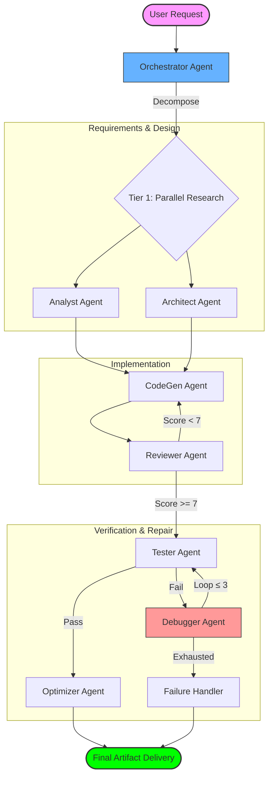

<div align="center">


<!-- Typing SVG -->
[](https://git.io/typing-svg)

<br/>

[](https://opensource.org/licenses/MIT)
[](https://www.python.org/downloads/)
[](https://github.com/langchain-ai/langgraph)
[](https://www.anthropic.com/claude)
[](https://www.docker.com/)
[](https://opentelemetry.io/)

</div>

---

## ◈ What is APEX?

> **APEX** is a sophisticated, autonomous multi-agent system engineered for complex software engineering tasks. Unlike simple code generators, APEX employs a tiered, self-correcting **DAG (Directed Acyclic Graph)** architecture — analyzing, architecting, implementing, reviewing, testing, and optimizing code inside a secure sandboxed environment.

**Not just code generation. A full autonomous SDLC engine.**

---

## ◈ System Architecture

APEX leverages **[LangGraph](https://github.com/langchain-ai/langgraph)** for advanced state management and conditional routing — making the coding process a recursive, self-healing workflow rather than a linear pipeline.



---

## ◈ 9 Specialist Agents

<div align="center">

| Agent | Core Responsibility | Technical Edge |
| :---: | :--- | :--- |
| 🎯 **Orchestrator** | Task decomposition & Routing | Dynamic DAG generation via LangGraph |
| 🔍 **Analyst** | Requirements Engineering | Semantic extraction of constraints & edge cases |
| 🏛️ **Architect** | System Design | Hierarchical file mapping & API contract design |
| ⚙️ **CodeGen** | Production Implementation | Context-aware generation with debug-patch merging |
| ✅ **Reviewer** | Quality Assurance | Hybrid AST (Ruff) metrics + LLM semantic scoring |
| 🧪 **Tester** | Verification | Automated Pytest generation & Sandbox execution |
| 🛠️ **Debugger** | Autonomous Repair | Traceback analysis & root-cause surgical patching |
| ⚡ **Optimizer** | Performance Engineering | Complexity analysis & hotspot optimization |
| 🛡️ **Failure Handler** | Graceful Degradation | Dead-letter queue & partial artifact recovery |

</div>

---

## ◈ Secure Execution & Analysis

APEX enforces a **multi-layered security and reliability strategy** at every stage:

<div align="center">

| Layer | Mechanism | Coverage |
|:---:|:---|:---|
| 🔒 **Subprocess Sandbox** | Memory caps, CPU quotas, `psutil` process tree cleanup | Local high-speed execution |
| 🐳 **Docker Isolation** | Disabled networking, read-only filesystem | High-risk isolated operations |
| 🔬 **AST Metrics** | Cyclomatic Complexity · Type Hint Coverage · Nesting Depth · Docstring Parity | Structural code analysis |

</div>

---

## ◈ Observability & Telemetry

Production-grade monitoring baked into the core — full visibility into agent reasoning and system performance.

```
📡  Distributed Tracing   →  OpenTelemetry + Jaeger    (full agentic flow visualization)
📊  Real-time Metrics     →  Prometheus exporters       (token usage, latency, quality scores)
📋  Structured Logging    →  structlog JSON             (ELK / Splunk ready)
📺  Dashboards            →  Grafana Mission Control    (pre-configured, zero-config)
```

**Monitoring Endpoints (after `docker compose up`):**

| Service | URL | Notes |
|:---:|:---:|:---|
| 🚀 FastAPI Docs | `http://localhost:8000/docs` | Interactive API explorer |
| 📊 Grafana | `http://localhost:3000` | `admin` / `apex-admin` |
| 📡 Prometheus | `http://localhost:9090` | Raw metrics |
| 🔭 Jaeger | `http://localhost:16686` | Distributed traces |

---

## ◈ Tech Stack

<div align="center">

### ⟡ Core Framework
[](https://www.python.org/)
[](https://github.com/langchain-ai/langgraph)
[](https://www.langchain.com/)
[](https://fastapi.tiangolo.com/)

### ⟡ AI / LLM
[](https://www.anthropic.com/claude)
[](https://openai.com/)

### ⟡ Infrastructure & Sandbox
[](https://www.docker.com/)
[](https://redis.io/)
[](https://docs.pytest.org/)

### ⟡ Observability
[](https://opentelemetry.io/)
[](https://prometheus.io/)
[](https://grafana.com/)
[](https://www.jaegertracing.io/)

### ⟡ Code Quality
[](https://docs.astral.sh/ruff/)
[](https://www.structlog.org/)

</div>

---

## ◈ Getting Started

### Prerequisites

```
✦  Python 3.10+
✦  Docker & Docker Compose
✦  Redis (state persistence)
✦  Anthropic API Key
```

### Installation

```bash
# Clone the repository
git clone https://github.com/Gypsianmonk/Apex_coding_agent.git
cd Apex_coding_agent

# Create and activate virtual environment
python -m venv .venv
source .venv/bin/activate        # Windows: .venv\Scripts\activate

# Install dependencies
pip install -r requirements.txt
```

### Configuration

```bash
# Copy environment template
cp .env.example .env

# Set your API key (required)
# ANTHROPIC_API_KEY=sk-ant-...
```

### Run

```bash
# Option A — Local Development
python main.py

# Option B — Full Production Stack (Recommended)
docker compose up -d
```

---

## ◈ API Integration

### REST — Synchronous

```bash
curl -X POST http://localhost:8000/api/v1/code \
  -H "Content-Type: application/json" \
  -H "X-API-Key: ${APEX_API_KEY}" \
  -d '{
    "request": "Implement a thread-safe Singleton pattern in Python with unit tests",
    "stream": false
  }'
```

### WebSocket — Real-Time Streaming

Perfect for IDE plugins or interactive frontends.

```javascript
const socket = new WebSocket('ws://localhost:8000/ws/code');

socket.onopen = () => {
  socket.send(JSON.stringify({
    request: "Create a data processing pipeline with Pydantic"
  }));
};

socket.onmessage = (event) => {
  const data = JSON.parse(event.data);
  console.log(`[${data.agent}] ${data.message}`);
};
```

---

## ◈ License

This project is licensed under the **[MIT License](LICENSE)** — use it freely.

---

<div align="center">


*"9 agents. One mission. Ship production-grade code — autonomously."*

**Built with ❤️ by [GypsianMonk](https://github.com/GypsianMonk)**

</div>
